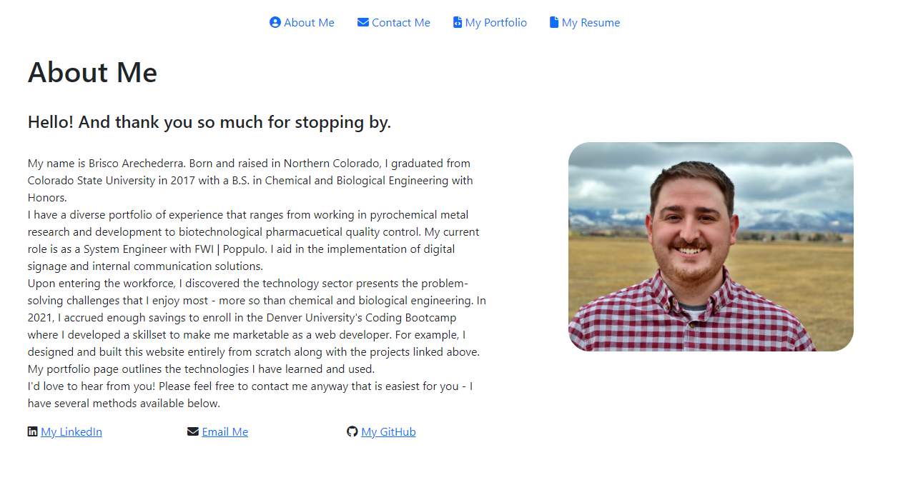
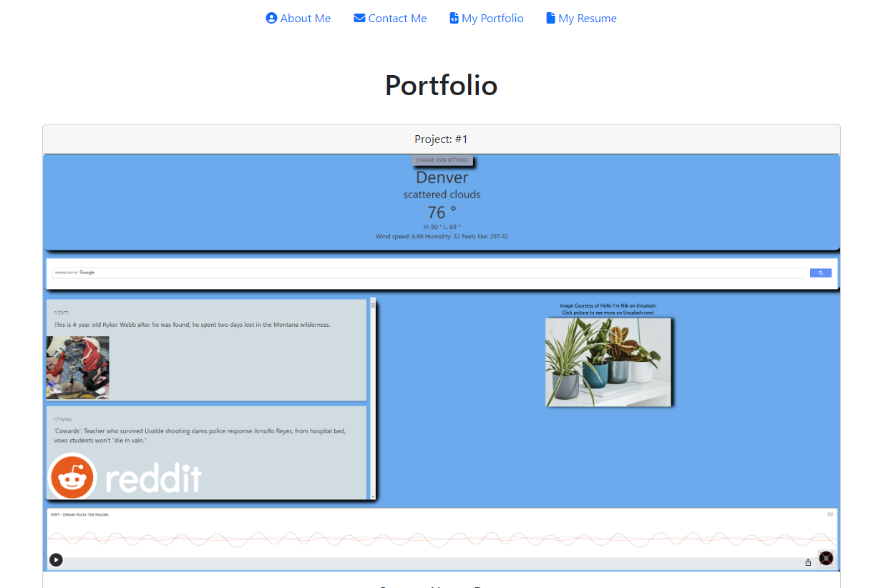
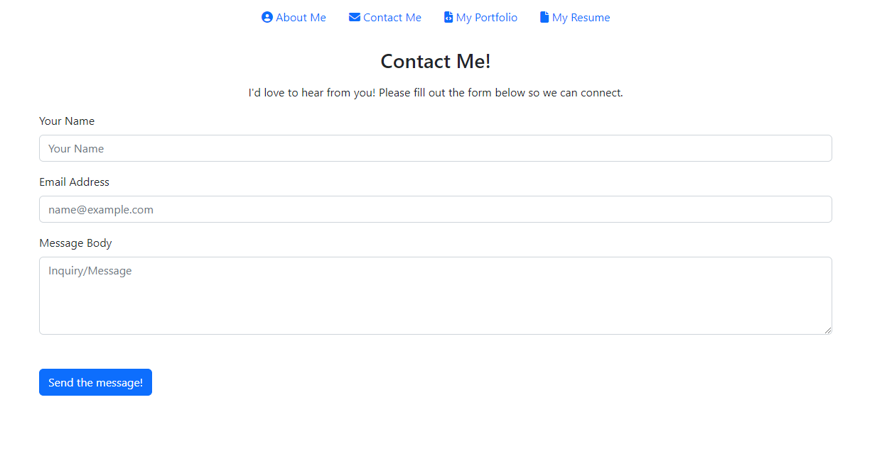
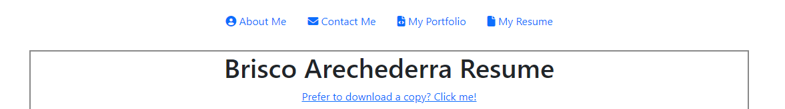

# React Portfolio 

    

## Description

This is a project that showcases my web development projects, my resume, an about me, and a contact form. This project uses the Bootstrap CSS Library and EmailJS for the contact me page. It is built using React - please reach out if you have any questions or would like to connect!  

## Table of Contents

[License](#license)

[Features](#features)

[Credits](#credits)

[Contact Me](#contact-me)
 

## License: 

This project is licensed under the MIT License .

---

## Features: 
This application has 4 pages including an "About Me"

A "Portfolio" page

A "Contact Me" page

And a "Resume" page

## Contact Me: 

Please use the portfolio to contact me!
 